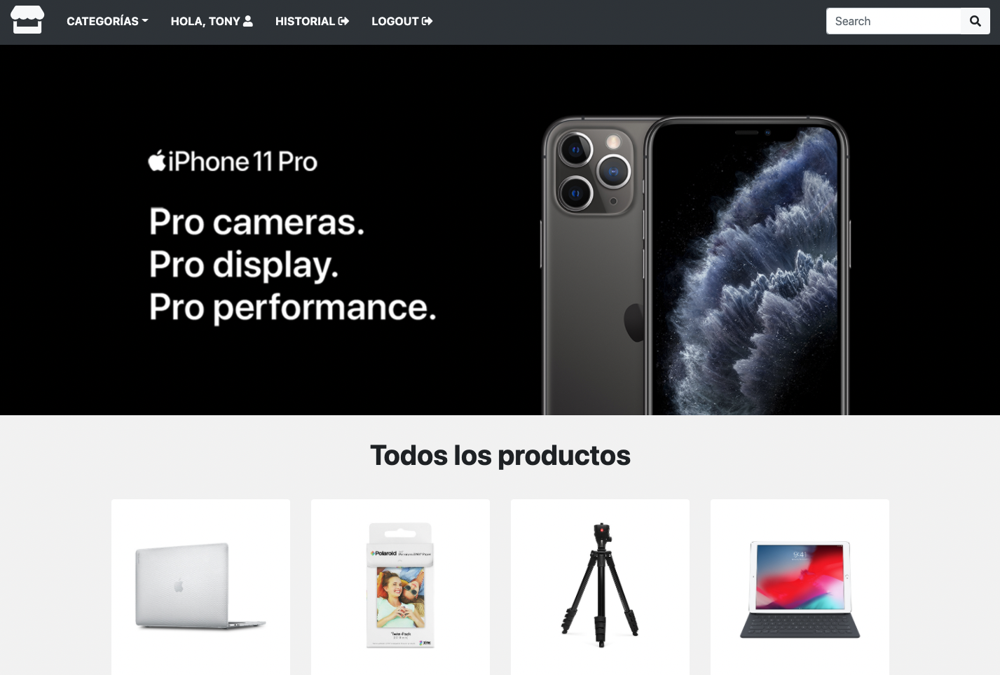
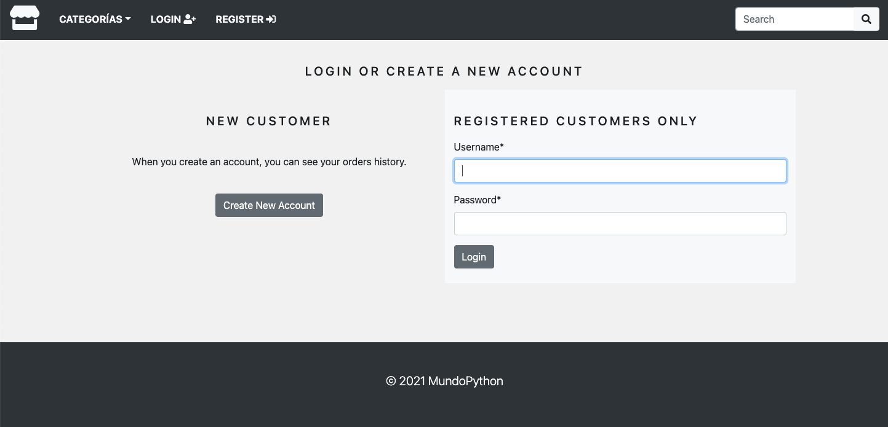
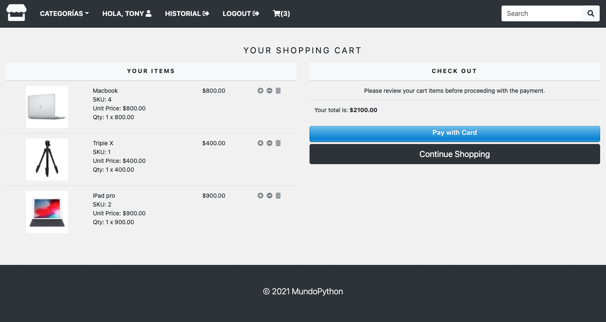
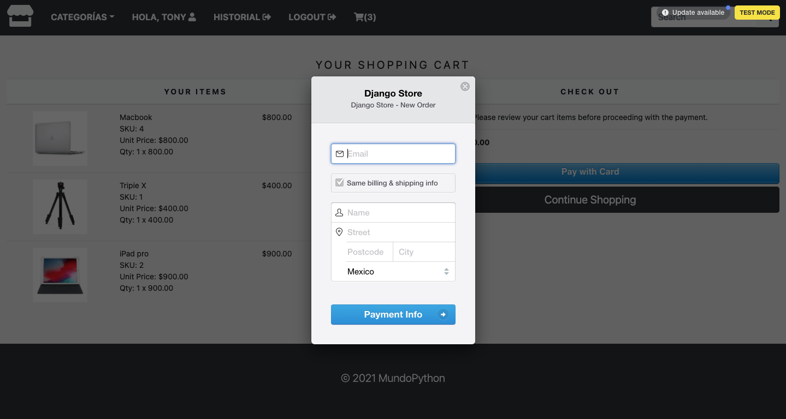
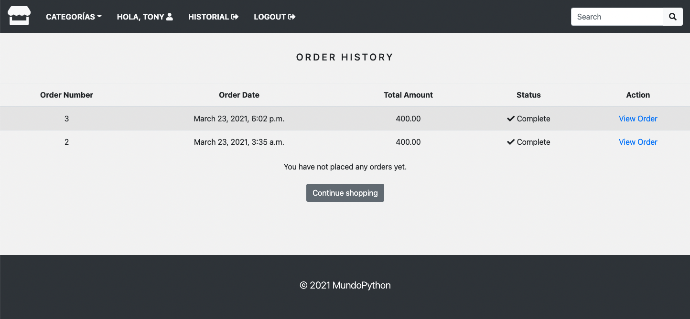

# Tienda online usando Django, Bootstrap y Stripe

Features - TODO:

 - Aceptar pagos usando Stripe
 - Poder filtar productos por categoría.
 - Agregar un buscador para los productos.
 - El carrito de compras debe permanecer toda la sesión del usuario.
 - Implementar login y registro de usuarios.
 - Poder ver el historial de compras.
 - Personalizar el sitio ADMIN.
 - Enviar email a usuarios del pedido.

# Screenshots

### Home Page

### Login page

### Cart page

### Stripe payment

### History orders

